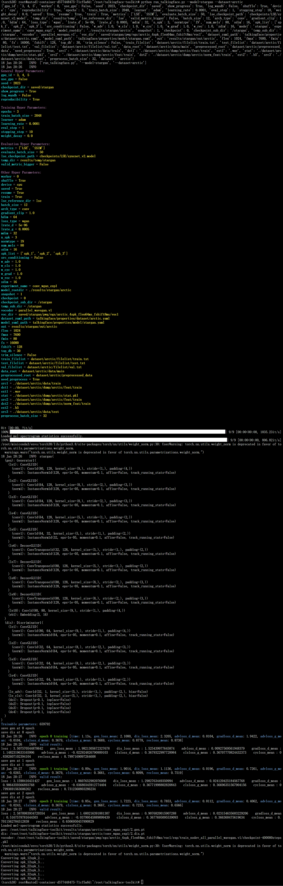

# StarGAN

## 作者信息
- **姓名**：肖天一
- **学号**：1120210575

## 环境配置
- 与要求一致

## 完成情况
- 能实现作业的要求。但注意以下特殊情况：
  - 需要把vocoder放置在对应路径下（eg.saved/stargan/pwg，不过源码可以使用两种vocoder）
  - `quickstart` 中导入了自定义的`collate_fn`（`dataloader`用的）
  - `trainer` 中导入了多个库，并重写了`evaluate` 方法

## 命令行对应命令
- python run_talkingface.py --model=stargan --dataset=arctic

## vocoder（从StarGAN的README.md截的）
1. Place a copy of the directory `parallel_wavegan` from https://github.com/kan-bayashi/ParallelWaveGAN in `pwg/`.
2. HiFi-GAN models trained on several databases can be found [here](https://drive.google.com/drive/folders/1RvagKsKaCih0qhRP6XkSF07r3uNFhB5T?usp=sharing). Once these are downloaded, place them in `pwg/egs/`. Please contact me if you have any problems downloading.
3. Optionally, Parallel WaveGAN can be used instead for waveform generation. The trained models are available [here](https://drive.google.com/drive/folders/1zRYZ9dx16dONn1SEuO4wXjjgJHaYSKwb?usp=sharing). Once these are downloaded, place them in `pwg/egs/`. 

## 验证截图

![----]
